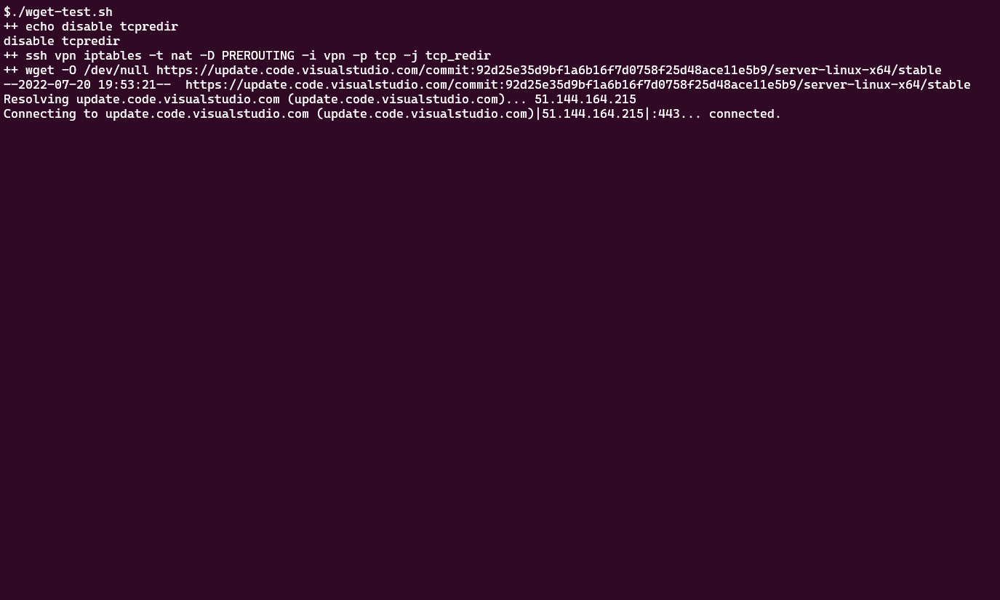

# TCPREDIR

## 工作原理

tcpredir是工作在L4上的用户态转发程序，其行为更像是透明代理。

该程序接收来自用户的连接请求，会去主动连接用户期望连接的目的地址。

形成两个TCP连接，client-tcpredir,tcpredir-server，并将这两个连接之间的数据进行一个透明交换。

tcpredir的优势在于收到一端的数据时可以直接回复ACK，使发送者能尽快发送余下的数据。

本地缓冲区毕竟是有限的，满了就无法回复ACK，发送端依然会降低速度，这是TCP流控的基本原理。

另一方面，tcpredir接收到的数据是用来发送给连接的另一端，我们真正的目的是替换发送方的流控算法来缩短数据传输到接收端的时间。

这是内核转发无法做到的，因为内核转发工作在L3，只能朴素地转发IP报文。

```shell
# 推荐使用bbr流控算法
sysctl -w net.core.default_qdisc=fq
sysctl -w net.ipv4.tcp_congestion_control=bbr
```


## 测速

经过测试在某些场景下能获得约10倍的速度提升。

| tcpredir 状态 | wget 平均速度 |
| ------------- | ------------- |
| 禁用          | **1.06MB/s**  |
| 启用          | **11.2MB/s**  |




## 缺点

### 开销更大

tcpredir在L4上进行转发的CPU开销和内存开销远高于内核协议栈在L3上实现的转发。

### 无法感知连接错误

部署本项目后，客户端无法感知到connection refuse, connection reset。

connection refuse会被处理为connected + closed

connection reset 会被处理为 closed


## 使用方法

### 安装依赖库

```shell
apt install libboost-dev libboost-system-dev
```

### 开始编译

```shell
mkdir build
cd build
cmake .. -DCMAKE_BUILD_TYPE=Release
make
```

### 使用配置

```shell
# tcpredir以无参数方式启动即可，目前不支持传参配置端口号，之后需配置iptables
# 注意，这条规则会影响所有传入的TCP连接，包括ssh登录到服务器
# 建议根据自己的场景编写iptables规则，只处理自己感兴趣的连接
iptables -t nat -A PREROUTING -p tcp -j REDIRECT --to-ports 1000
```
